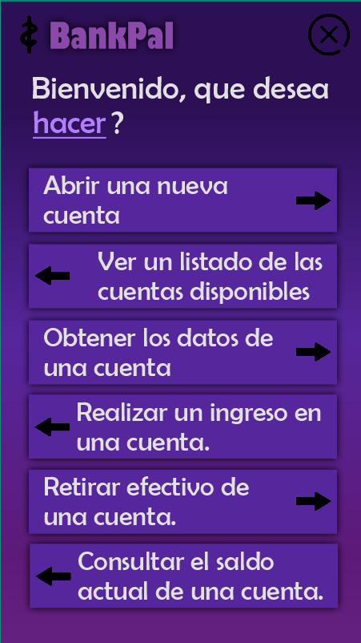
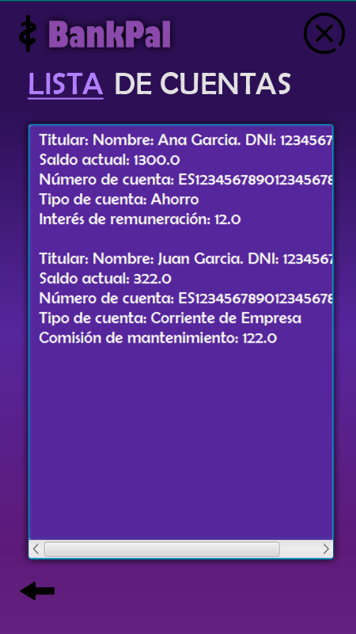
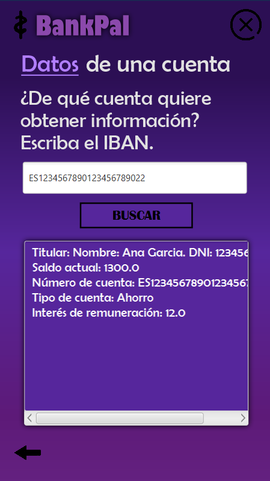
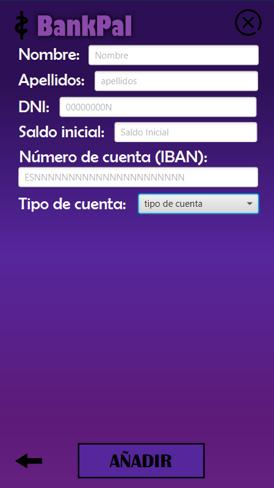
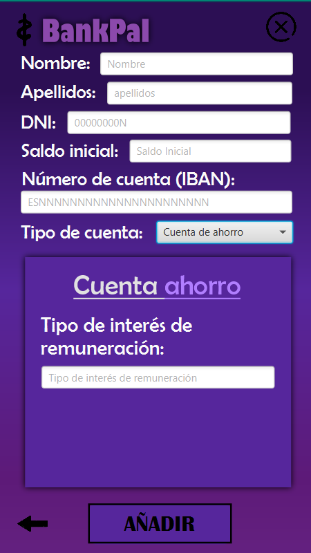
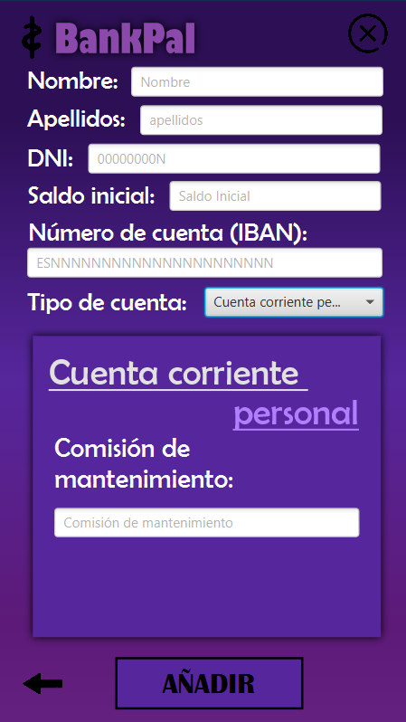
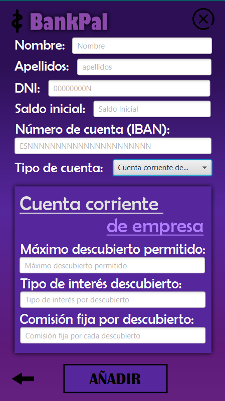
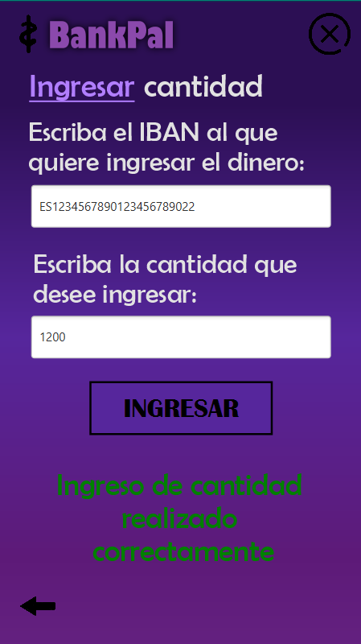
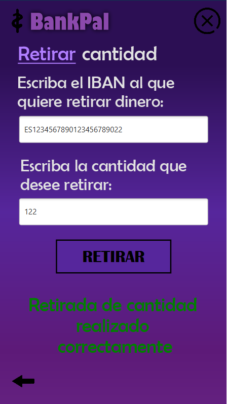
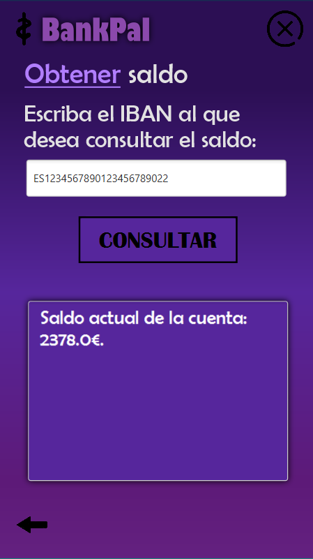

# 1ª PRÁCTICA: REPASO PROGRAMACIÓN
Desarrollar una aplicación Java que permita gestionar varios tipos de cuentas bancarias.   

## Menú
Mediante un menú se podrán elegir determinadas operaciones:
1. Abrir una nueva cuenta
2. Ver un listado de las cuentas disponibles (código de cuenta, titular y saldo actual). 
3. Obtener los datos de una cuenta concreta. Realizar un ingreso en una cuenta. 
4. Retirar efectivo de una cuenta. 
5. Consultar el saldo actual de una cuenta. 
6. Salir de la aplicación.

## Aplicación
Cuando se vaya a abrir una nueva cuenta bancaria, el usuario trendrá que solicitar al cliente:
- **Datos personales**: nombre, apellidos y DNI.
- **Tipo de cuenta** que desea abrir: cuenta de ahorro, cuenta corriente personal o cuenta 
corriente de empresa.
- **Saldo inicial**.  

Además de esa información, el usuario de la aplicación deberá también incluir: 
- **Número de cuenta** (IBAN) de la nueva cuenta, el cual se validará con una expresión 
regular (no es obligatorio) y deberá tener formato ESNNNNNNNNNNNNNNNNNNNN, 
donde N es un dígito del 0 al 9. 
- **Tipo de interés de remuneración**, si se trata de una cuenta de ahorro. 
- **Comisión de mantenimiento**, si es una cuenta corriente personal. 
- **Máximo descubierto permitido**, si se trata de una cuenta corriente de empresa. 
- **Tipo de interés por descubierto**, en el caso de una cuenta corriente de empresa. 
- **Comisión fija por cada descubierto**, también para el caso de una cuenta corriente de 
empresa.

## Clases
Se deberá crear una clase Banco el cuál dispondra de los siguientes métodos: 
1) **abrirCuenta**: recibe por parámetro un objeto CuentaBancaria y lo almacena en 
la estructura. Devuelve true o false indicando si la operación se realizó con 
éxito.
2) **listadoCuentas**: no recibe parámetro y devuelve un array donde cada elemento 
es una cadena que representa la información de una cuenta. 
3) **informacionCuenta**: recibe un iban por parámetro y devuelve una cadena con 
la información de la cuenta o null si la cuenta no existe. 
4) **ingresoCuenta**: recibe un iban por parámetro y una cantidad e ingresa la 
cantidad en la cuenta. Devuelve true o false indicando si la operación se realizó 
con éxito. 
5) **retiradaCuenta**: recibe un iban por parámetro y una cantidad y trata de retirar 
la cantidad de la cuenta. Devuelve true o false indicando si la operación se 
realizó con éxito. 
6) **obtenerSaldo**: Recibe un iban por parámetro y devuelve el saldo de la cuenta si 
existe. En caso contrario devuelve -1.  

## $BankPal

  

 

Beginning                               | Menu                                    |      Accounts List                           |  Account Information                    
:------------------------------------------:|:-------------------------------------------:|:-----------------------------------------:|:--------------------------------------------:|
  |  | | |

Insert Account  |
:-------------------------------------------:|
   |   

 
 Deposit Money                       | Withdraw Money                  | Check Balance
:-----------------------------------------------:|:-------------------------------------:|:-------------------------------------:|
| | |

 

---

  <h2>¡Disfruta de la aplicación!</h2>

>_IES Ribera de Castilla 24/25._
